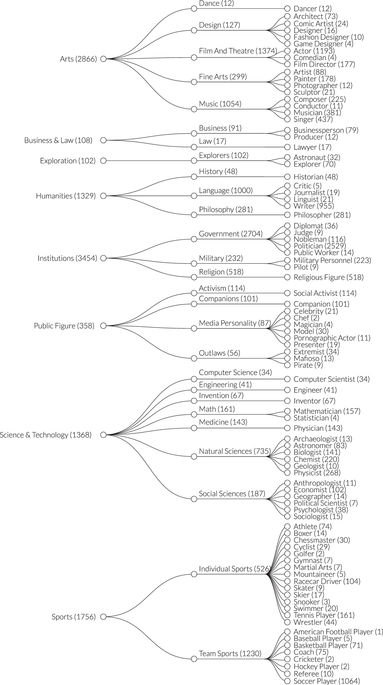

<link rel="stylesheet" type="text/css" href="style.css">
```{r message=FALSE, warning=FALSE, include=FALSE}
library(readr)
library(highcharter)
library(ggplot2)
```

# مقدمه و معرفی داده

<div class = "persian_normal">
در این پروژه به بررسی شخصیت&zwnj;های معروف جهانی می&zwnj;پردازیم. برای اطلاعات اشخاص از داده&zwnj;ی Pantheon استفاده می&zwnj;کنیم. این داده از ویکیپدیا استخراج شده است و شامل اطلاعات تمام افرادی که صفحه&zwnj;ی  در مورد آن&zwnj;ها به حداقل ۲۵ زبان موجود است می&zwnj;باشد.  این شرط به این معنی است که این&zwnj;ها افرادی هستند که در سطح جهان معروف هستند. 
</div>

<div class = "persian_normal">
اطلاعات حدود ۱۲ هزار نفر از ۳۵۰۰ سال قبل از میلاد تا به امروز که در این شرط صدق می&zwnj;کنند در این داده گردآوری 
و تمیز شده است. در این داده زمینه&zwnj;های کاری در ۳ مرحله دسته&zwnj;بندی شده&zwnj;اند که نفش بسیار مفیدی در تحلیل ما ایفا کردند. این دسته&zwnj;بندی به صورت زیر است:
</div>

<div align="center">

</div>

<div class = "persian_normal">
در طی انجام کار برای پرسش دادن به برخی پرسش&zwnj;ها از منابع دیگری هم استفاده کردیم. برای پاسخ به پرسش “آیا معروف شدن در آسیا دشوارتر است” از داده&zwnj;ی موفقیت&zwnj;های بشر استفاده کردیم که به طور کلی انسان&zwnj;ها موثر در زمینه&zwnj;های مختلف را جمع&zwnj;آوری کرده است. همچنین به تحلیل عواطف متن صفحات ویکیپدیای اشخاص نیز پرداخته&zwnj;ایم که برای آن به ویکیپدیا رجوع کرده و با crawl کردن داده را استخراج کردیم.
</div>
<div class = "persian_normal">
در پروپوزال نوشتیم که می&zwnj;خواهیم محبوبیت&zwnj;ها در نقاط مختلف جهان را بررسی کنیم. به دلایل فنی اما این کار ممکن نشد. جزئیات بیشتر در بخش مشکلات فنی آمده است.
</div>
<div class = "persian_normal">
حاصل این تحلیل&zwnj;ها و زحمات، نتایجی بعضا قابل&zwnj;توجه و جذابی شده است که در ادامه خواهید دید. در بخش آخر هم به اختصار به تشریح مسائل فنی و مشکلاتی که با آن روبرو شدیم می&zwnj;پردازیم.
</div>
#بررسی مکانی

##بررسی کلی

<div class = "persian_normal">
در این بخش سعی می&zwnj;کنیم بر روی موقعیت مکانی افراد متمرکز شویم. برای داشتن دید کلی ابتدا با استفاده از طول و عرض جغرافیایی که به دست آوردیم، سعی کردیم یک نمودار تعاملی از موقعیت افراد در گذر زمان به رسم کنیم. 
</div>
```{r echo = FALSE}
read_rds('../../output/worldBubbleTimePlot.rds')
```

<div class = "persian_normal">
اندازه&zwnj;ی نقاط متناسب با HPI که شاخصی برای "بزرگی" فرد (بر اساس بازدید صفحات و زمان تولد) است می&zwnj;باشد. در نمودار زیر هم می&zwnj;توانید سهم هر کشور در افراد معروف قرون مختلف را ببینید:
</div>

```{r echo = FALSE}
read_rds('../../output/countryTimePlot.rds')
```

<div class = "persian_normal">
نمودار موقعیت مکانی تمام افراد در تمام ادوار هم به شکل زیر است:
</div>
```{r echo = FALSE}
read_rds('../../output/worldPointPlot.rds')
```

<div class = "persian_normal">
مهم&zwnj;ترین نکته&zwnj;ای که توجه را به خود جلب می&zwnj;کند این است که حتی در دورانی که به دوران اوج شرق مشهور است، بیشتر افراد در اروپا قرار دارند. این مسئله کنجکاوی ما را برانگیخت! به دنبال راهی گشتیم تا این مسئله را بررسی کنیم که آیا واقعا تعداد افراد موثر بر جهان در اروپا بیشتر بوده است یا کسانی که در اروپا بودند بیشتر معروف شده&zwnj;اند. برای همین سعی کردیم با داده&zwnj;ای دیگر به این سوال پاسخ دهیم. با جستجو به داده&zwnj;ی موفقیت&zwnj;های بشر ) Human Accomplishments ) رسیدیم. 
</div>
##آیا واقعا در آسیا مشهور شدن دشوارتر است؟

<div class = "persian_normal">
برای پاسخ دادن به این پرسش از داده&zwnj;ی موفقیت&zwnj;های بشر استفاده می&zwnj;کنیم. 
</div>
###داده&zwnj;ی موفقیت&zwnj;های بشر 

<div class = "persian_normal">
این داده توسط چارلز موری به عنوان کتاب چاپ و اخیرا به طور رایگان منتشر شده است. موری در این کتاب اطالاعات ۴۰۰۰ مبتکر در زمینه&zwnj;های هنر و علم را از ۸۰۰ سال قبل از میلاد مسیح تا سال ۱۹۵۰ را جمع&zwnj;آوری کرده است. او همچنین برای افراد یک شاخص نشانگر اهمیت کارهای آن شخص به دست آورده است. برای مشخص کردن افراد و این شاخص او به منابع اصلی هر رشته (دایرة المعارف&zwnj;ها، کتب تاریخی و ...) و همچنین نظرسنجی&zwnj;ها مراجعه کرده است و بر اساس این که منابع چقدر به شخص پرداخته&zwnj;اند و در نظرسنجی&zwnj;ها چه گفته شده میزان اهمیت کار افراد را پیدا کرده است و ۴۰۰۰ نفر را برگزیده است. خوبی این داده این است که به معروفیت افراد وابستگی کمی دارد و می&zwnj;توانیم افرادی را در آن بیابیم که بسیار موثر بوده&zwnj;اند ولی معروف نشده&zwnj;اند. این به ما کمک می&zwnj;کند به سوالی که مطرح کردیم پاسخ بدهیم.
</div>

<div class = "persian_normal">
استفاده از این داده و اتصال آن به داده&zwnj;ی اصلی زحمات زیادی داشت که در بخش مشکلات فنی آورده شده است. اما بعد از انجام این کار توانستیم فرضیه&zwnj;مان را بررسی کنیم. از بین افراد داده&zwnj;ی HA افرادی را که در داده&zwnj;ی pantheon موجود بودند یعنی به معروفیت رسیده&zwnj;اند را جدا کردیم. حال شاخص دهک آخر افراد در هر ناحیه را مقایسه می&zwnj;کنیم. به این معنی که نگاه می&zwnj;کنیم کسی که در مرز ۱۰ درصد پایینی است چه شاخصی داشته است. هر چه این مقدار بیشتر باشد به این معنی است که افراد آن ناحیه برای معروفیت باید کار مهم&zwnj;تری انجام دهند. نتیجه به این صورت است:
</div>
```{r echo = FALSE}
read_rds('../../output/indexComparisonPlot.rds')
```

<div class = "persian_normal">
می&zwnj;بینیم که آسیایی&zwnj;ها برای این که در جهان امروز معروف باشند باید به مقدار قابل توجهی کار مهم&zwnj;تری کرده باشند!
</div>
##شغل معروف کشورها

<div class = "persian_normal">
یکی از بررسی&zwnj;های جالبی که می&zwnj;توان با این داده کرد پیدا کردن شغلی است که بیشترین شهرت را برای هر کشور آورده است. به طور دقیق&zwnj;تر، شخصیت&zwnj;های کدام شغل بیشترین سهم را در بازدیدهای شخصیت&zwnj;های هر کشور داشته&zwnj;اند؟ نتیجه را در زیر می&zwnj;بینید:
</div>

```{r echo = FALSE}
read_rds('../../output/countryOccupationPlot.rds')
```


<div class = "persian_normal">
میبینید که در اکثر کشورها سیاستمداران بیشترین سهم را دارند. دلیل این موضوع این است که شخصیتهای تاریخی پربازدید پادشاهان هستند و این کشورها اکثر بازدید خود را از آنها دارند. اما در کشورهایی تفاوتهایی وجود دارد برای مثال در آمریکا و کانادا و استرالیا بازیگران بیشترین بازدید را دارند. شهرت فوتبالیستان از اسپانیا و تعدادی از کشورهای آمریکای جنوبی  نیز جالب توجه است. در برخی کشورهای کوچک هم تک شخصیتهای معروف نتیجه را مشخص کردهاند. مانند فدرر برای سوئیس یا چنگیزخان برای مغولستان از این دست هستند.
</div>

#تحلیل زمانی

##آیا واقعا در گذشته مشهور شدن آسان&zwnj;تر بوده است؟

<div class = "persian_normal">
بسیاری معتقدند در گذشته معروف شدن آسان&zwnj;تر بوده است. این اتفاق معمولا در هنگام مطالعه&zwnj;ی موضوعات علمی رخ می&zwnj;دهد که می&zwnj;بینیم در زمان&zwnj;های قدیمی افراد با به دست آوردن نتایجی که به نظر ما آسان به نظر می&zwnj;آیند نامشان در تاریخ ثبت شده است. برای بررسی این موضوع تعداد اشخاص معروف در قرون مختلف را بررسی کردیم. همانطور که انتظار داریم این مقدار بیشتر شده است. اما این موضوع برای نتیجه&zwnj;گیری کافی نیست زیرا در طی زمان جمعیت هم به طور قابل توجهی بیشتر شده است و باید دید چه کثری از افراد معروف می&zwnj;شوند. همین موضوع را بررسی می&zwnj;کنیم. تعداد افراد معروف در هر میلیون نفر را به دست می&zwnj;آوریم. نتیجه را در زیر می&zwnj;بینید:
</div>
```{r echo = FALSE}
read_rds('../../output/centuryCountPlot.rds')
```

<div class = "persian_normal">
نتیجه قابل توجه است. این نسبت در طول تاریخ تقریبا ثابت مانده است اما در قرن اخیر ناگهان با گسترش ارتباطات این نسبت جهشی فوق&zwnj;العاده داشته است! پس برخلاف تصور این افراد زمان ما بهترین زمان برای معروف شدن است.
</div>
##سهم قاره&zwnj;ها در طی زمان

<div class = "persian_normal">
یکی دیگر از مسائل جالب ظهور و افول قاره&zwnj;ها است. همه شنیده&zwnj;ایم که آسیا در گذشته مهد علم و تمدن بوده است ولی امروزه اروپا و آمریکا از آن پیشی گرفته&zwnj;اند. به بررسی این موضوع می&zwnj;پردازیم. سهم هر قاره از اشخاص معروف در طی زمان را در زیر می&zwnj;بینید:
</div>

```{r echo = FALSE}
read_rds('../../output/timeContinentPlot.rds')
```

<div class = "persian_normal">
نمودار به خودی خود بیانگر درستی این موضوع است. سهم آسیا از ۱۰۰ درصد به شدت کاهش یافته است و اروپا در طی زمان رشد کرده است. در دو قرن اخیر هم آمریکا ناگهان سهمی بزرگی را مال خود کرده است.
</div>
##زمینه&zwnj;های کاری در طی زمان

<div class = "persian_normal">
در هر برهه از تاریخ در یک زمینه&zwnj;ی کاری اشخاص بزرگی پدید آمده&zwnj;اند. سعی می&zwnj;کنیم این تغییرات را بررسی کنیم. برای این کار بررسی می&zwnj;کنیم شخصیت&zwnj;های کدام زمینه بیشترین سهم را در بازدیدهای شخصیت&zwnj;های هر قرن داشته&zwnj;اند. نتیجه به این صورت است:
</div>
```{r echo = FALSE}
read_rds('../../output/domainVisitTimePlot.rds')
```

<div class = "persian_normal">
می&zwnj;بینیم که سهم institutions که اشخاص مذهبی و سیاسی هستند کمتر و کمتر شده است و در قرون اخیر هنر ناگهان رشد کرده است. برای بررسی دقیق&zwnj;تر یک لایه پایین&zwnj;تر را بررسی می&zwnj;کنیم:
</div>
```{r echo = FALSE}
read_rds('../../output/industryVisitTimePlot.rds')
```

<div class = "persian_normal">
در این نمودار هم کاهش سیاست و مذهب واضح است. موسیقی، سینما و تئاتر بیشترین رشد را در قرون اخیر داشته&zwnj;اند.
</div>

#بررسی عواطف صفحات ویکیپدیا

<div class = "persian_normal">
یکی از کارهای جذاب تحلیل متن صفحه&zwnj;ی ویکیپدیای اشخاص است. با استفاده از این می&zwnj;توان اطلاعات جالبی در مورد شغل&zwnj;ها به دست آورد. تغییرات این عواطف برای اشخاص دوره&zwnj;های مختلف هم جالب است. استخراج این داده کار آسانی نبوده است. برای جزئیات این فرایند به بخش فنی مراجعه کنید.
</div>
##عواطف شغل&zwnj;ها

<div class = "persian_normal">
می&zwnj;توانیم بررسی کنیم که بار احساسی کلمات صفحات مربوط به اشخاص هر صنعت به چه صورت بوده است. این موضوع در مورد این که آن صنعت به چه صورت است اطلاعاتی به ما می&zwnj;دهد. این&zwnj;ها احساستی هستند که خواندن درباره&zwnj;ی اشخاص آن زمینه به ما منتقل می&zwnj;کند. نتایج را در زیر می&zwnj;بینید:
</div>
```{r echo = FALSE}
read_rds('../../output/industrySentimentPlot.rds')
```

<div class = "persian_normal">
از موارد جالب بالا بودن اعتماد در  کارهایی مانند علوم کامپیوتر و ریاضی یا بالا بودن پیشدستی در ورزش&zwnj;ها است. در ادامه بیشتر این موضوعات را تحلیل می&zwnj;کنیم.
</div>
<div class = "persian_normal">
در نمودار زیر تنها مثبت یا منفی بودن متن صفحات را بررسی کرده&zwnj;ایم:
</div>
```{r echo = FALSE}
read_rds('../../output/industryPositivePlot.rds')
```

<div class = "persian_normal">
می&zwnj;بینیم که رقص و موسیقی مثبت&zwnj;ترین متن&zwnj;ها را دارند. حضور علوم کامپیوتر بسیار تعجب&zwnj;آور است! از آن طرف قانون&zwnj;شکنان و نظامیان منفی&zwnj;ترین متن&zwnj;ها را دارند.
</div>
##شغل&zwnj;های عواطف

<div class = "persian_normal">
دانستن این که چه شغلی بیشتر از همه دارای یک جنبه&zwnj;ی عاطفی خاص است هم جالب است. برای هر جنبه ۳ شغل برتر را پیدا کردیم. نتایج را ببینید و لذت ببرید!
</div>
```{r echo = FALSE}
library(knitr)
kable(read_rds('../../output/sentimentTopOccupations.rds'))
```


##عواطف در طی زمان
<div class = "persian_normal">
کنجکاو شدیم که این عواطف برای اشخاص دوره&zwnj;ها مختلف به چه صورت است. نتیجه را در نمودار زیر ببینید:
</div>
```{r echo = FALSE}
read_rds('../../output/timeSentimentPlot.rds')
```
<div class = "persian_normal">
اکثر جوانب ثابت بوده&zwnj;اند. در این بین مثبت بودن از بقیه تغییرات جذاب&zwnj;تری دارد:
</div>
```{r echo = FALSE}
read_rds('../../output/timePositivePlot.rds')
```
<div class = "persian_normal">
می&zwnj;بینیم که برای اشخاص قدیمی به طور کلی متن&zwnj;ها مثبت&zwnj;تر هستند هر چند اخیرا متن&zwnj;ها مثبت&zwnj;تر شده اند...
</div>


#بررسی برابری جنسیتی

##شغل&zwnj;هایی که زنان را معروف می&zwnj;کنند

<div class = "persian_normal">
برای بررسی شغل&zwnj;ها سهم زنان از افراد معروف هر شغل را بررسی می&zwnj;کنیم. نتیجه به این صورت است:
</div>

```{r echo = FALSE}
read_rds('../../output/genderOccupationPlot.rds')
```

<div class = "persian_normal">
می&zwnj;بینیم که model ،   pornographic actor و companion بیشترین درصد زنان را دارند.
</div>
##کشورهایی که زنان بیشتر معروف می&zwnj;شوند
<div class = "persian_normal">
سهم زنان را در  شخصیت&zwnj;های کشورهای مختلف بررسی می&zwnj;کنیم. نتیجه به این صورت است:
</div>
```{r echo = FALSE}
read_rds('../../output/genderEQcountryPlot.rds')
```

<div class = "persian_normal">
همانطور که مشاهده می&zwnj;کنید در اکثر کشورها مردان بخش بیشتری از شخصیت&zwnj;ها را تشکیل می&zwnj;دهند.  در حقیقت ۸۷ درصد کل افراد این داده مرد هستند!
</div>

#بررسی بازدیدها
<div class = "persian_normal">
در این بخش بازدیدهای صفحات ویکیپدیا را بررسی می&zwnj;کنیم. 
</div>
##بازدید جهانی
<div class = "persian_normal">
مشاغل، صنایع و زمینه&zwnj;های پربازدید ویکیپدیای انگلیسی را استخراج کردیم که در زیر قابل مشاهده است:
</div>

```{r echo = FALSE}
read_rds('../../output/highVisit/dom_glbl.rds')
read_rds('../../output/highVisit/ind_glbl.rds')
read_rds('../../output/highVisit/occ_glbl.rds')
```


##بازدید فارسی

<div class = "persian_normal">
مشاغل، صنایع و زمینه&zwnj;های پربازدید ویکیپدیای انگلیسی را استخراج کردیم که در زیر قابل مشاهده است:
</div>
```{r echo = FALSE}
read_rds('../../output/highVisit/dom_fa.rds')
read_rds('../../output/highVisit/ind_fa.rds')
read_rds('../../output/highVisit/occ_fa.rds')
```


##بازدید در طی زمان

<div class = "persian_normal">
یک موضوع دیگر هم که می&zwnj;تواند جالب باشد این است که از سال ۲۰۰۸ تا ۲۰۱۳ که بازدید صفحات در داده موجود است، بازدید صنایع مختلف چگونه تغییر کرده است. این تغییرات به شکل زیر است:
</div>
```{r echo = FALSE}
read_rds('../../output/industryVisitHistoryPlot.rds')
```

<div class = "persian_normal">
افزایش بازدید ورزشکاران در زمان&zwnj;های المپیک و جام&zwnj;جهانی قابل توجه است!
</div>
#مسائل فنی و سختی&zwnj;ها


##فایل&zwnj;های پروژه


<div class = "persian_normal">
ساختار فایل&zwnj;های پروژه به شکل زیر است:
</div>

```{r eval = F}
data
|-- pantheon
|-- HA
|-- generated
    |--HA-PAN_linkage.csv
    |--missingCitiesLocations.csv
    |--pantheon_cleaned.csv
    |--wikipedia
            |--raw/
            |--wikipediaTexts.csv
            |--sentiments.csv
reports
|-- firstReport
|-- finalReport
rscripts
|-- requirements.R
|-- locationFetch.R
|-- data_cleaning.R
|-- HA_linkage.R
|-- locationAnalysis.R
|-- genderAnalaysis.R
|-- sentimentCalculate.R
|-- timeAnalysis.R
|-- visitAnalysis.R
|-- wikipediaAnalysis.R
|-- wikipediaFetch.R
output
|-- (plots)
run_all.R
ReadMe.md
.gitignore
DA_project.Rproj
```


<div class = "persian_normal">
data:
در این پوشه داده&zwnj;ها قرار می&zwnj;گیرند. Pantheon و HA (که به آن خواهیم پرداخت)  داده&zwnj;های خام هستند.  پوشه&zwnj;ی generated شامل داده&zwnj;هایی است که از روی داده&zwnj;ی خام یا با اجرای یک کد به دست می&zwnj;آید. 
</div>

<div class = "persian_normal">
rscripts:
دکدها در این پوشه قرار دارند. فایل requirements.R شامل تمام کتابخانه&zwnj;های ضروری برای اجرای کدها است.
</div>

<div class = "persian_normal">
output:
در این پوشه خروجی کدها برای مثال نمودارها قرار داده می&zwnj;شوند. در گزارش&zwnj;ها از این فایل&zwnj;ها استفاده می&zwnj;شود.
</div>

<div class = "persian_normal">
reports:
گزارش&zwnj;ها در این پوشه قرار داده می&zwnj;شوند. گزارش تحلیل هر موضوع در گزارشی جدا قرار خواهد گرفت.
</div>

<div class = "persian_normal">
run_all.R:
این کد تمام کدها را اجرا می&zwnj;کند تا گزارش&zwnj;ها تولید شوند.
</div>

<p class = "persian_header">
کنترل نسخه
</p>

<div class = "persian_normal">
برای کنترل نسخه از github استفاده کردیم. می&zwnj;توانید آن را در
<a href = 'https://github.com/arakhsha/famous-people-analysis' target = '_blank'> اینجا </a>
مشاهده کنید.   با توجه به یک نفری بودن پروژه نیازی به همگام سازی مداوم نسخه&zwnj;ی آنلاین نیست و معمولا این نسخه مقداری عقب&zwnj;تر است.
</div>

<p class = "persian_header">
تمیزسازی داده
</p>

<div class = "persian_normal">
علیرغم این که داده بسیار تمیز بود ولی بازهم برای انجام برخی کارها به تمیزکردن بیشتری نیاز بود. برای همین در ابتدا مدتی به تمیزکردن داده پرداختیم.
برای استفاده و هرگونه تحلیلی نیاز داشتیم که برخی مشکلات داده را برطرف کنیم.  برای همین در data_cleaning.R به این کار پرداخته&zwnj;ایم. اولین مشکل این بود که در داده، برای برخی مقادیر که موجود نبودند، مقدارهایی از قبیل Other و ... ذکر شده بود که حل آن ساده بود:
</div>

```{r eval = FALSE}
data[data == 'Unknown' | data == 'Other' | data == 'UNK'] = NA
```


<div class = "persian_normal">
مشکل بعدی عددی نبودن برخی تاریخ&zwnj;های تولد بود که با توجه به تعداد کم آن&zwnj;ها به سادگی حل شد:
</div>

```{r eval = FALSE}
#birthyear
data$birthyear[data$birthyear == '530s'] = 535
data$birthyear[data$birthyear == '1237?'] = 1237
data$birthyear = as.numeric(data$birthyear)
```

<div class = "persian_normal">
مشکل اصلی اما موجود نبودن مختصات جغرافیایی برای بخش مهمی از داده بود. با توجه به این که افراد در این داده از زمان&zwnj;های بسیار دور هستند، محل تولد آن&zwnj;ها با توجه به مرزهایی کنونی آنقدر اهمیت ندارد زیرا این مرزها بسیار تفاوت کرده&zwnj;اند برای همین داشتن مختصات جغرافیایی نه تنها برای تصویرسازی&zwnj;ها مهم است، برای تحلیل&zwnj;های جغرافیایی هم حیاتی است. خوشبختانه اسم شهر، یا کشور محل تولد تعداد قابل قبولی از این افراد موجود بود. برای یافتن مختصات جغرافیایی از google maps و پکیج ggmap برای استخراج مختصات استفاده کردیم. که اصلا ساده نبود. علاوه بر محدودیت&zwnj;های api که از سرعت می&zwnj;کاست و به خطاهای نامربوط منجر می&zwnj;شد، تحریم بودن این سرویس هم کار را مشکل کرد. مجبور شدیم برای هر شهر، به طور میانگین ۵ درخواست ارسال کنیم که با توجه به محدودیت&zwnj;ها مشکلاتی ایجاد کرد. این فرایند در فایل locationFetch.R انجام می&zwnj;شود و نتیجه با نام missingCitiesLocations.csv ذخیره می&zwnj;شود:
</div>

```{r eval = FALSE}
locationNAs = data %>% filter(is.na(LAT) | is.na(LON))

missingCities = sort(unique(locationNAs$birthcity))
missingCities = missingCities[!is.na(missingCities)]

missingCitiesLocations = data.frame(city = character(), lon = numeric(), lat = numeric())
for(city in missingCities[51:171]) {
  print(which(missingCities == city))
  try = TRUE;
  while(try) {
    tryCatch(
      {
        result = geocode(city, force = T)
        try = FALSE
      },
      warning = function(war) {
        if(str_detect(war, 'OVER_QUERY_LIMIT')) {
          print(war)
          try <<- TRUE
        }
        else {
          print(war)
          try <<- FALSE
          result <<- data.frame(lon = NA, lat = NA)
        }
      })
  }
  row = cbind(as.data.frame(city), result)
  print(row)
  missingCitiesLocations = rbind(missingCitiesLocations, row)
}

write_csv(missingCitiesLocations, 'data/generated/missingCitiesLocations.csv')
```

<div class = "persian_normal">
در نهایت در data_cleaning.R این مختصات را به داده اضافه کردیم و داده&zwnj;ی تمیز شده&zwnj;ی نهایی را به نام pantheon_cleaned.csv ذخیره کردیم:
</div>


```{r eval = FALSE}

#birth locations
data = data %>%
  group_by(birthcity) %>% 
  mutate(LAT = ifelse(is.na(LAT) & !is.na(birthcity), first(LAT[!is.na(LAT)]), LAT),
         LON = ifelse(is.na(LON) & !is.na(birthcity), first(LON[!is.na(LON)]), LON)
  ) %>% 
  ungroup()
locationNAs = data %>% filter(is.na(LAT) | is.na(LON))
missingCitiesLocation = read_csv('data/generated/missingCitiesLocations.csv')
locationNAs = left_join(
  locationNAs %>% select(-LON, -LAT),  
  missingCitiesLocation %>% rename(birthcity = city, LON = lon, LAT = lat),
  by = 'birthcity'
)
data = rbind(
    data %>% filter(!is.na(LON), !is.na(LAT)),
    locationNAs
  ) %>% 
  arrange(name)
write_csv(data, 'data/generated/pantheon_cleaned.csv')
```


##ارتباط داده&zwnj;ی HA با داده&zwnj;ی اصلی


<div class = "persian_normal">
برای این که بتوانیم تحلیلی انجام دهیم باید بتوانیم این دو داده را به هم متصل کنیم و سطرهایی که مربوط به یک شخص هستند را پیدا کنیم. این کار با توجه به این که اسم افراد در دو داده به یک صورت نیامده کار آسانی نیست. مخصوصا در داده&zwnj;ی موفقیت&zwnj;ها ( HA ) اسم افراد به روش&zwnj;های مختلفی آمده است. ممکن است در یک داده اسم وسط آمده باشد و در دیگری نیامده باشد، اسم افراد غیرانگلیسی به روش&zwnj;های مختلف نوشته شده باشد و...
</div>

<div class = "persian_normal">
در ابتدا سعی کردیم از پکیج RecordLinkage استفاده کنیم اما متاسفانه موفق به گرفتن خروجی مناسبی نشدیم. برای همین سعی کردیم خودمان این کار را انجام دهیم.
</div>

<div class = "persian_normal">
به دلیل تفاوت&zwnj;ها در اسم افراد در دو داده باید سعی کنیم تا حدی این اسامی را به هم شبیه کنیم. برای این کار: نام کوچک و بزرگ را استخراج و با ترتیب درست می&zwnj;چسبانیم، حروف غیرانگلیسی را به مشابه انگلیسی آن&zwnj;ها تبدیل می&zwnj;کنیم، نام&zwnj;ها وسط را حذف می&zwnj;کنیم و تمام حروف را به کوچک تبدیل می&zwnj;کنیم. مرحله&zwnj;ی بعدی این است که معیاری برای شباهت اسامی به دست آوریم. مترهای گوناگونی برای این مسئله موجود است که در پکیج stringdist پیاده سازی شده&zwnj;اند. مترهای مختلف را آزمایش کردیم و برخی مقالات مربوط به این کار را خواندیم و در نهایت از osa استفاده کردیم. در نهایت باید جفت سطرهایی که مربوط به یک نفر هستند را مشخص می&zwnj;کردیم. خوشبختانه در دو داده تاریخ تولد افراد هم موجود بود. با این که منابع مختلف ممکن است برای یک شخص تاریخ&zwnj;های متفاوتی ذکر کنند، این اعداد معمولا به هم شبیه هستند. با ترکیبی از این دو عامل و مقداری بررسی دستی، به مرز قابل قبولی رسیدیم. این فرآیند در HA_linkage.R انجام می&zwnj;شود و نتیجه را ذخیره می&zwnj;کند.
</div>

```{r eval = FALSE}
library(readxl)
library(stringr)
library(stringdist)
HA = read_excel('data/HA/HA.xlsx')
comma = HA %>% filter(str_detect(Name, ','))
regular = HA %>% filter(!str_detect(Name, ','))
commaNames = comma$Name %>% 
  str_split_fixed(',', 2) %>% 
  as.data.frame() %>% 
  rename(last = V1, first = V2) %>% 
  mutate(original = comma$Name) %>% 
  mutate(fisrt = str_trim(first, side = 'both'),
         last = str_trim(last, side = 'both')) %>% 
  mutate(reformated = paste(first,last))
comma$Name = commaNames$reformated
HA = rbind(regular, comma) %>% 
  mutate(Name = str_trim(Name, side = 'both')) %>% 
  arrange(Name) 


pantheon = read_csv('data/generated/pantheon_cleaned.csv')

pantheon_sci = pantheon %>% 
  select(pname = name, pbirth = birthyear, en_curid)
HA_unique = HA %>%
  select(Name, Serial, Birth) %>%
  distinct() %>% 
  select(hname = Name, hbirth = Birth, Serial)

to.plain <- function(s) {
  
  # 1 character substitutions
  old1 <- "šžþàáâãäåçćčèéêëìíîïðñòóôõöùúûüý"
  new1 <- "szyaaaaaaccceeeeiiiidnooooouuuuy"
  s1 <- chartr(old1, new1, s)
  
  # 2 character substitutions
  old2 <- c("œ", "ß", "æ", "ø")
  new2 <- c("oe", "ss", "ae", "oe")
  s2 <- s1
  for(i in seq_along(old2)) s2 <- gsub(old2[i], new2[i], s2, fixed = TRUE)
  
  s2
}

standardizeName = function(s) {
  result = str_to_lower(to.plain(s))
  fname = str_extract(result, "^[[:graph:]]+ ")
  fname[is.na(fname)] = ""
  lname = str_extract(result, "[[:graph:]]+$")
  result = paste(fname, lname)
  result = str_trim(result, side = 'both')
  return(result)
}
pantheon_sci = pantheon_sci %>% mutate(pname = standardizeName(pname))
HA_unique = HA_unique %>% mutate(hname = standardizeName(hname))

matchings = expand.grid(
  HA$Serial,
  pantheon_sci$en_curid
)
colnames(matchings) = c('Serial', 'en_curid')
matchings = matchings %>% left_join(pantheon_sci) %>% left_join(HA_unique)
matchings = matchings %>% 
  mutate(birth_dist = abs(hbirth - pbirth)) %>% 
  filter(birth_dist < 30)
matchings = matchings %>%
  mutate(name_dist = stringdist(hname, pname))

matchings = matchings %>% 
  filter(name_dist < 2 | (name_dist == 2 & birth_dist <= 5) | (name_dist == 3 & birth_dist <= 0)) 
matchings = matchings %>% 
  select(Serial, en_curid)

write_csv(matchings, 'HA-PAN_linkage.csv')
```

##استخراج صفحات ویکیپدیا

<div class = "persian_normal">
همانطور که در بخش بررسی عواطف صفحات ویکیپدیا دیدید در بخشی از پروژه به متن صفحات اشخاص نیاز داشتیم. با توجه به این که داده شامل ۱۲ هزار شخص است، فرآیند استخراج این صفحات زمان&zwnj;بر و مشکل&zwnj;آفرین بود. بعد از آن&zwnj;هم متن&zwnj;ها باید تحلیل&zwnj;می&zwnj;شدند. این تحلیل هم مقدار خوبی زمان برد.
</div>

##استخراج داده&zwnj;ی محبوبیت محلی

<div class = "persian_normal">
در پروپوزال آورده بودیم که می&zwnj;خواهیم که با gTrends این که هر شخص به چه صورتی در جهان محبوب است را به دست آوریم و محبوبیت اشخاص را هم به طور در نقاط مختلف بررسی کنیم. اما وقتی خواستیم این کار را انجام دهیم متوجه مشکلات آن شدیم. اول این که افراد کشورها اشخاص را به زبان&zwnj;ها مختلفی جستجو می&zwnj;کنند. با این که اسم اشخاص را به زبان&zwnj;های مختلف داشتیم ولی باز هم باید تمام آن&zwnj;ها را بررسی می&zwnj;کردیم. دوم محدودیت API بود. نمی&zwnj;توان بیشتر از ۵ عبارت را با هم مقایسه کرد و برای مقایسه تمام افراد نیاز به تلاش&zwnj;های بسیاری است که با توجه به تعداد افراد شدنی نیست. همچنین در بررسی محبوبیت در بخش&zwnj;های مختلف، مقدار مطلق داده نمی&zwnj;شود. محل با بیشترین جستجو مقدار ۱۰۰ را می&zwnj;گیرد. این موضوع هم کار را سخت&zwnj;تر می&zwnj;کند. البته با تمام این موارد می&zwnj;شد با فرض&zwnj;هایی کارهایی کرد. اما فرض&zwnj;ها آنقدر زیاد بودند که نتایجی که با آن&zwnj;ها به دست می&zwnj;آمد را زیر سوال می&zwnj;بردند. برای همین از این کار صرف نظر کردیم. 
</div>

##رسم نمودار&zwnj;های تعاملی

<div class = "persian_normal">
این کار نیازمند یادگیری کار با پلاگین motion برای کتابخانه&zwnj;ی highcharter بود که زمان زیادی به دلیل نبود مستند سازی خوب گرفت. همچنین داشتن یک نمودار خوب و ثابت نگه داشتن مقیاس معروفیت در گذر زمان با این که شاید به نظر نیاید وقت زیادی گرفت.
</div>