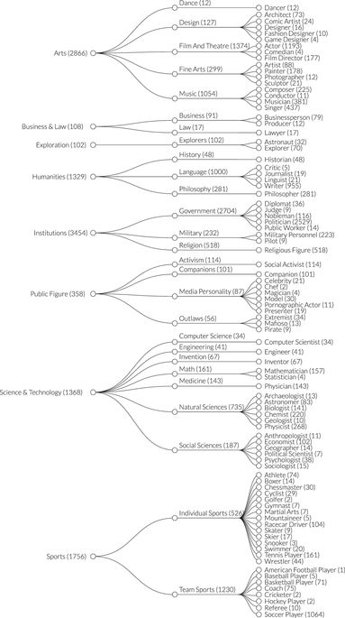

<link rel="stylesheet" type="text/css" href="style.css">
```{r message=FALSE, warning=FALSE, include=FALSE}
library(readr)
library(highcharter)
library(ggplot2)
```

<p class = "persian_header">
مقدمه
</p>

<div class = "persian_normal">
در این پروژه به بررسی شخصیت&zwnj;های معروف جهانی می&zwnj;پردازیم. برای اطلاعات اشخاص از داده&zwnj;ی Pantheon استفاده می&zwnj;کنیم. این داده از ویکیپدیا استخراج شده است و شامل اطلاعات تمام افرادی که صفحه&zwnj;ی  در مورد آن&zwnj;ها به حداقل ۲۵ زبان موجود است می&zwnj;باشد.  این شرط به این معنی است که این&zwnj;ها افرادی هستند که در سطح جهان معروف هستند. اطلاعات حدود ۱۲ هزار نفر از ۳۵۰۰ سال قبل از میلاد تا به امروز که در این شرط صدق می&zwnj;کنند در این داده گردآوری و تمیز شده است. در این گزارش پیشرفت فعلی کار را ارائه می&zwnj;دهیم.
</div>

<p class = "persian_header">
فایل&zwnj;های پروژه
</p>

<div class = "persian_normal">
ساختار فایل&zwnj;های پروژه به شکل زیر است:
</div>

```{r eval = F}
data
|-- pantheon
|-- HA
|-- generated
    |--HA-PAN_linkage.csv
    |--missingCitiesLocations.csv
    |--pantheon_cleaned.csv
reports
|-- firstReport
rscripts
|-- requirements.R
|-- locationFetch.R
|-- data_cleaning.R
|-- HA_linkage.R
|-- locationAnalysis.R
|-- genderAnalaysis.R
output
|-- worldBubbleTimePlot.rds
|-- worldPointPlot.rds
run_all.R
ReadMe.md
.gitignore
DA_project.Rproj
```


<div class = "persian_normal">
data:
در این پوشه داده&zwnj;ها قرار می&zwnj;گیرند. Pantheon و HA (که به آن خواهیم پرداخت)  داده&zwnj;های خام هستند.  پوشه&zwnj;ی generated شامل داده&zwnj;هایی است که از روی داده&zwnj;ی خام یا با اجرای یک کد به دست می&zwnj;آید. 
</div>

<div class = "persian_normal">
rscripts:
دکدها در این پوشه قرار دارند. فایل requirements.R شامل تمام کتابخانه&zwnj;های ضروری برای اجرای کدها است.
</div>

<div class = "persian_normal">
output:
در این پوشه خروجی کدها برای مثال نمودارها قرار داده می&zwnj;شوند. در گزارش&zwnj;ها از این فایل&zwnj;ها استفاده می&zwnj;شود.
</div>

<div class = "persian_normal">
reports:
گزارش&zwnj;ها در این پوشه قرار داده می&zwnj;شوند. گزارش تحلیل هر موضوع در گزارشی جدا قرار خواهد گرفت.
</div>

<div class = "persian_normal">
run_all.R:
این کد تمام کدها را اجرا می&zwnj;کند تا گزارش&zwnj;ها تولید شوند.
</div>

<p class = "persian_header">
کنترل نسخه
</p>

<div class = "persian_normal">
برای کنترل نسخه از github استفاده کردیم. می&zwnj;توانید آن را در
<a href = 'https://github.com/arakhsha/famous-people-analysis' target = '_blank'> اینجا </a>
مشاهده کنید.   با توجه به یک نفری بودن پروژه نیازی به همگام سازی مداوم نسخه&zwnj;ی آنلاین نیست و معمولا این نسخه مقداری عقب&zwnj;تر است.
</div>

<p class = "persian_header">
تمیزسازی داده
</p>

<div class = "persian_normal">
برای استفاده و هرگونه تحلیلی نیاز داشتیم که برخی مشکلات داده را برطرف کنیم.  برای همین در data_cleaning.R به این کار پرداخته&zwnj;ایم. اولین مشکل این بود که در داده، برای برخی مقادیر که موجود نبودند، مقدارهایی از قبیل Other و ... ذکر شده بود که حل آن ساده بود:
</div>

```{r eval = FALSE}
data[data == 'Unknown' | data == 'Other' | data == 'UNK'] = NA
```


<div class = "persian_normal">
مشکل بعدی عددی نبودن برخی تاریخ&zwnj;های تولد بود که با توجه به تعداد کم آن&zwnj;ها به سادگی حل شد:
</div>

```{r eval = FALSE}
#birthyear
data$birthyear[data$birthyear == '530s'] = 535
data$birthyear[data$birthyear == '1237?'] = 1237
data$birthyear = as.numeric(data$birthyear)
```

<div class = "persian_normal">
مشکل اصلی اما موجود نبودن مختصات جغرافیایی برای بخش مهمی از داده بود. با توجه به این که افراد در این داده از زمان&zwnj;های بسیار دور هستند، محل تولد آن&zwnj;ها با توجه به مرزهایی کنونی آنقدر اهمیت ندارد زیرا این مرزها بسیار تفاوت کرده&zwnj;اند برای همین داشتن مختصات جغرافیایی نه تنها برای تصویرسازی&zwnj;ها مهم است، برای تحلیل&zwnj;های جغرافیایی هم حیاتی است. خوشبختانه اسم شهر، یا کشور محل تولد تعداد قابل قبولی از این افراد موجود بود. برای یافتن مختصات جغرافیایی از google maps و پکیج ggmap برای استخراج مختصات استفاده کردیم. که اصلا ساده نبود. علاوه بر محدودیت&zwnj;های api که از سرعت می&zwnj;کاست و به خطاهای نامربوط منجر می&zwnj;شد، تحریم بودن این سرویس هم کار را مشکل کرد. مجبور شدیم برای هر شهر، به طور میانگین ۵ درخواست ارسال کنیم که با توجه به محدودیت&zwnj;ها مشکلاتی ایجاد کرد. این فرایند در فایل locationFetch.R انجام می&zwnj;شود و نتیجه با نام missingCitiesLocations.csv ذخیره می&zwnj;شود:
</div>

```{r eval = FALSE}
locationNAs = data %>% filter(is.na(LAT) | is.na(LON))

missingCities = sort(unique(locationNAs$birthcity))
missingCities = missingCities[!is.na(missingCities)]

missingCitiesLocations = data.frame(city = character(), lon = numeric(), lat = numeric())
for(city in missingCities[51:171]) {
  print(which(missingCities == city))
  try = TRUE;
  while(try) {
    tryCatch(
      {
        result = geocode(city, force = T)
        try = FALSE
      },
      warning = function(war) {
        if(str_detect(war, 'OVER_QUERY_LIMIT')) {
          print(war)
          try <<- TRUE
        }
        else {
          print(war)
          try <<- FALSE
          result <<- data.frame(lon = NA, lat = NA)
        }
      })
  }
  row = cbind(as.data.frame(city), result)
  print(row)
  missingCitiesLocations = rbind(missingCitiesLocations, row)
}

write_csv(missingCitiesLocations, 'data/generated/missingCitiesLocations.csv')
```

<div class = "persian_normal">
در نهایت در data_cleaning.R این مختصات را به داده اضافه کردیم و داده&zwnj;ی تمیز شده&zwnj;ی نهایی را به نام pantheon_cleaned.csv ذخیره کردیم:
</div>


```{r eval = FALSE}

#birth locations
data = data %>%
  group_by(birthcity) %>% 
  mutate(LAT = ifelse(is.na(LAT) & !is.na(birthcity), first(LAT[!is.na(LAT)]), LAT),
         LON = ifelse(is.na(LON) & !is.na(birthcity), first(LON[!is.na(LON)]), LON)
  ) %>% 
  ungroup()
locationNAs = data %>% filter(is.na(LAT) | is.na(LON))
missingCitiesLocation = read_csv('data/generated/missingCitiesLocations.csv')
locationNAs = left_join(
  locationNAs %>% select(-LON, -LAT),  
  missingCitiesLocation %>% rename(birthcity = city, LON = lon, LAT = lat),
  by = 'birthcity'
)
data = rbind(
    data %>% filter(!is.na(LON), !is.na(LAT)),
    locationNAs
  ) %>% 
  arrange(name)
write_csv(data, 'data/generated/pantheon_cleaned.csv')
```

<p class = "persian_header">
تحلیل مکانی
</p>

<div class = "persian_normal">
در این بخش سعی می&zwnj;کنیم بر روی موقعیت مکانی افراد متمرکز شویم. برای داشتن دید کلی ابتدا با استفاده از طول و عرض جغرافیایی که به دست آوردیم، سعی کردیم یک نمودار تعاملی از موقعیت افراد در گذر زمان به رسم کنیم. این کار نیازمند یادگیری کار با پلاگین motion برای کتابخانه&zwnj;ی highcharter بود که زمان زیادی به دلیل نبود مستند سازی خوب گرفت. همچنین داشتن یک نمودار خوب و ثابت نگه داشتن مقیاس معروفیت در گذر زمان با این که شاید به نظر نیاید وقت زیادی گرفت. کد این نمودرا را به علت حجم زیاد در اینجا نمی&zwnj;آوریم ولی نتیجه را می&zwnj;توانید در زیر ببینید:
</div>

```{r echo = FALSE}
read_rds('../../output/worldBubbleTimePlot.rds')
```

<br/>
<br/>
<div class = "persian_normal">
اندازه&zwnj;ی نقاط متناسب با HPI که شاخصی برای "بزرگی" فرد (بر اساس بازدید صفحات و زمان تولد) است می&zwnj;باشد. زمینه&zwnj;های کاری مشخص شده هم به این صورت هستند:
</div>

<div align="center">

</div>

<div class = "persian_normal">
نمودار موقعیت مکانی تمام افراد در تمام ادوار هم به شکل زیر است:
</div>

```{r echo = FALSE, fig.align='center'}
read_rds('../../output/worldPointPlot.rds')
```

<div class = "persian_normal">
مهم&zwnj;ترین نکته&zwnj;ای که توجه را به خود جلب می&zwnj;کند این است که حتی در دورانی که به دوران اوج شرق مشهور است، بیشتر افراد در اروپا قرار دارند. این مسئله کنجکاوی ما را برانگیخت! به دنبال راهی گشتیم تا این مسئله را بررسی کنیم که آیا واقعا تعداد افراد موثر بر جهان در اروپا بیشتر بوده است یا کسانی که در اروپا بودند بیشتر معروف شده&zwnj;اند. برای همین سعی کردیم با داده&zwnj;ای دیگر به این سوال پاسخ دهیم. با جستجو به داده&zwnj;ی موفقیت&zwnj;های بشر ( Human Accomplishments ) رسیدیم. تحلیل مکانی را موقتا در این مرحله متوقف کردیم تا در مورد این سوال تحقیق کنیم.
</div>

<p class = "persian_header">
داده&zwnj;ی موفقیت&zwnj;های بشر
</p>


<div class = "persian_normal">
این داده توسط چارلز موری به عنوان کتاب چاپ و اخیرا به طور رایگان منتشر شده است. موری در این کتاب اطالاعات ۴۰۰۰ مبتکر در زمینه&zwnj;های هنر و علم را از ۸۰۰ سال قبل از میلاد مسیح تا سال ۱۹۵۰ را جمع&zwnj;آوری کرده است. او همچنین برای افراد یک شاخص نشانگر اهمیت کارهای آن شخص به دست آورده است. برای مشخص کردن افراد و این شاخص او به منابع اصلی هر رشته (دایرة المعارف&zwnj;ها، کتب تاریخی و ...) و همچنین نظرسنجی&zwnj;ها مراجعه کرده است و بر اساس این که منابع چقدر به شخص پرداخته&zwnj;اند و در نظرسنجی&zwnj;ها چه گفته شده میزان اهمیت کار افراد را پیدا کرده است و ۴۰۰۰ نفر را برگزیده است. خوبی این داده این است که به معروفیت افراد وابستگی کمی دارد و می&zwnj;توانیم افرادی را در آن بیابیم که بسیار موثر بوده&zwnj;اند ولی معروف نشده&zwnj;اند. این به ما کمک می&zwnj;کند به سوالی که مطرح کردیم پاسخ بدهیم.
</div>

<div class = "persian_header">
ارتباط داده&zwnj;ی HA با داده&zwnj;ی اصلی
</div>

<div class = "persian_normal">
برای این که بتوانیم تحلیلی انجام دهیم باید بتوانیم این دو داده را به هم متصل کنیم و سطرهایی که مربوط به یک شخص هستند را پیدا کنیم. این کار با توجه به این که اسم افراد در دو داده به یک صورت نیامده کار آسانی نیست. مخصوصا در داده&zwnj;ی موفقیت&zwnj;ها ( HA ) اسم افراد به روش&zwnj;های مختلفی آمده است. ممکن است در یک داده اسم وسط آمده باشد و در دیگری نیامده باشد، اسم افراد غیرانگلیسی به روش&zwnj;های مختلف نوشته شده باشد و...
</div>

<div class = "persian_normal">
در ابتدا سعی کردیم از پکیج RecordLinkage استفاده کنیم اما متاسفانه موفق به گرفتن خروجی مناسبی نشدیم. برای همین سعی کردیم خودمان این کار را انجام دهیم.
</div>

<div class = "persian_normal">
به دلیل تفاوت&zwnj;ها در اسم افراد در دو داده باید سعی کنیم تا حدی این اسامی را به هم شبیه کنیم. برای این کار: نام کوچک و بزرگ را استخراج و با ترتیب درست می&zwnj;چسبانیم، حروف غیرانگلیسی را به مشابه انگلیسی آن&zwnj;ها تبدیل می&zwnj;کنیم، نام&zwnj;ها وسط را حذف می&zwnj;کنیم و تمام حروف را به کوچک تبدیل می&zwnj;کنیم. مرحله&zwnj;ی بعدی این است که معیاری برای شباهت اسامی به دست آوریم. مترهای گوناگونی برای این مسئله موجود است که در پکیج stringdist پیاده سازی شده&zwnj;اند. مترهای مختلف را آزمایش کردیم و برخی مقالات مربوط به این کار را خواندیم و در نهایت از osa استفاده کردیم. در نهایت باید جفت سطرهایی که مربوط به یک نفر هستند را مشخص می&zwnj;کردیم. خوشبختانه در دو داده تاریخ تولد افراد هم موجود بود. با این که منابع مختلف ممکن است برای یک شخص تاریخ&zwnj;های متفاوتی ذکر کنند، این اعداد معمولا به هم شبیه هستند. با ترکیبی از این دو عامل و مقداری بررسی دستی، به مرز قابل قبولی رسیدیم. این فرآیند در HA_linkage.R انجام می&zwnj;شود و نتیجه را ذخیره می&zwnj;کند.
</div>

```{r eval = FALSE}
library(readxl)
library(stringr)
library(stringdist)
HA = read_excel('data/HA/HA.xlsx')
comma = HA %>% filter(str_detect(Name, ','))
regular = HA %>% filter(!str_detect(Name, ','))
commaNames = comma$Name %>% 
  str_split_fixed(',', 2) %>% 
  as.data.frame() %>% 
  rename(last = V1, first = V2) %>% 
  mutate(original = comma$Name) %>% 
  mutate(fisrt = str_trim(first, side = 'both'),
         last = str_trim(last, side = 'both')) %>% 
  mutate(reformated = paste(first,last))
comma$Name = commaNames$reformated
HA = rbind(regular, comma) %>% 
  mutate(Name = str_trim(Name, side = 'both')) %>% 
  arrange(Name) 


pantheon = read_csv('data/generated/pantheon_cleaned.csv')

pantheon_sci = pantheon %>% 
  select(pname = name, pbirth = birthyear, en_curid)
HA_unique = HA %>%
  select(Name, Serial, Birth) %>%
  distinct() %>% 
  select(hname = Name, hbirth = Birth, Serial)

to.plain <- function(s) {
  
  # 1 character substitutions
  old1 <- "šžþàáâãäåçćčèéêëìíîïðñòóôõöùúûüý"
  new1 <- "szyaaaaaaccceeeeiiiidnooooouuuuy"
  s1 <- chartr(old1, new1, s)
  
  # 2 character substitutions
  old2 <- c("œ", "ß", "æ", "ø")
  new2 <- c("oe", "ss", "ae", "oe")
  s2 <- s1
  for(i in seq_along(old2)) s2 <- gsub(old2[i], new2[i], s2, fixed = TRUE)
  
  s2
}

standardizeName = function(s) {
  result = str_to_lower(to.plain(s))
  fname = str_extract(result, "^[[:graph:]]+ ")
  fname[is.na(fname)] = ""
  lname = str_extract(result, "[[:graph:]]+$")
  result = paste(fname, lname)
  result = str_trim(result, side = 'both')
  return(result)
}
pantheon_sci = pantheon_sci %>% mutate(pname = standardizeName(pname))
HA_unique = HA_unique %>% mutate(hname = standardizeName(hname))

matchings = expand.grid(
  HA$Serial,
  pantheon_sci$en_curid
)
colnames(matchings) = c('Serial', 'en_curid')
matchings = matchings %>% left_join(pantheon_sci) %>% left_join(HA_unique)
matchings = matchings %>% 
  mutate(birth_dist = abs(hbirth - pbirth)) %>% 
  filter(birth_dist < 30)
matchings = matchings %>%
  mutate(name_dist = stringdist(hname, pname))

matchings = matchings %>% 
  filter(name_dist < 2 | (name_dist == 2 & birth_dist <= 5) | (name_dist == 3 & birth_dist <= 0)) 
matchings = matchings %>% 
  select(Serial, en_curid)

write_csv(matchings, 'HA-PAN_linkage.csv')
```

<div class = "persian_normal">
در آینده با استفاده از این دو داده سعی می&zwnj;کنیم تحلیل&zwnj;هایی انجام دهیم.
</div>

<div class = "persian_header">
تحلیل جنسیتی
</div>

<div class = "persian_normal">
این تحلیل در مراحل اولیه&zwnj;ی کار است و کار زیادی در آن انجام نشده است. برای شروع نمودار نسبت بازدید صفحات زنان را رسم کردیم:
</div>

```{r echo = FALSE, fig.align='center'}
read_rds('../../output/femaleVisitsByTime.rds')
```

<div class = "persian_normal">
قصد داریم در آینده زمینه&zwnj;های کاری و کشورهایی&zwnj;که زنان مشهور بیشتری دارند و همیجنین زبان&zwnj;های ویکیپدیایی که زنان در آن&zwnj;ها بیشتر بازدید می&zwnj;شوند را بیابیم.
</div>